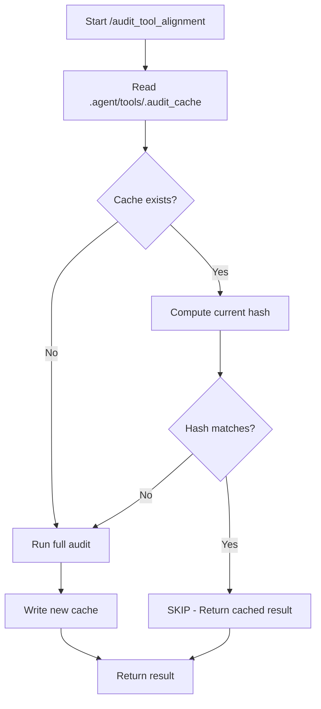

# Token Efficiency Analysis v5: Deep Dive on `/suite_full_audit`

**Date**: 2026-01-30
**Commit**: `af7f24c`

---

## Executive Summary

This analysis provides a **step-by-step token breakdown** of `/suite_full_audit` and compares v3 → v4 → v5 estimates. The key finding: **script coverage has plateaued at ~35%**, and further gains require Phase 1.5 (root workflow optimization).

---

## Workflow Tree

```mermaid
graph TD
    A["/suite_full_audit"] --> B["Step -1: check_workflow_skip.exe 🔧"]
    A --> C["Step 0: /audit_tool_alignment 🧠"]
    A --> D["Step 1: /suite_docs"]
    A --> E["Step 2: /audit_code_quality"]
    A --> F["Step 3: /suite_tests"]
    A --> G["Step 4: /audit_infrastructure"]
    A --> H["Step 5: Final Report 🧠"]
    
    D --> D1["/audit_context"]
    D --> D2["/audit_consistency"]
    D --> D3["/maintenance_annex_migration 🧠"]
    D --> D4["/maintenance_annex_review 🧠"]
    D --> D5["/audit_constants"]
    D --> D6["/audit_dependencies"]
    D --> D7["/audit_workflows 🧠"]
    
    F --> F1["/audit_gherkin"]
    F --> F2["/audit_step_glue 🧠"]
```



---

## Per-Step Token Breakdown

### Step -1: Workflow Skip Detection
| Component | Tokens |
|-----------|--------|
| Script execution | ~50 |
| Parse output | ~100 |
| **Subtotal** | **~150** |

---

### Step 0: `/audit_tool_alignment` (ROOT)
| Component | 🔧 Script | 🧠 Agent | Tokens |
|-----------|-----------|----------|--------|
| Read Cargo.toml | — | ✓ | ~200 |
| Read 8 Rust files | — | ✓ | ~3,200 |
| Read 8+ workflows | — | ✓ | ~1,600 |
| Semantic comparison | — | ✓ | ~15,000 |
| Correction (if needed) | — | ✓ | ~5,000 |
| Verification | — | ✓ | ~2,000 |
| **Subtotal** | **0** | **100%** | **~27,000** |

---

### Step 1: `/suite_docs`

| Sub-Workflow | 🔧 Script | 🧠 Agent | Agent Est. |
|--------------|-----------|----------|------------|
| `/audit_context` | check_context.exe | Semantics, Overlaps | ~3,000 |
| `/audit_consistency` | check_consistency.exe | Contradictions, Fallacies | ~3,000 |
| `/maintenance_annex_migration` | — | Full | ~2,500 |
| `/maintenance_annex_review` | — | Full | ~2,500 |
| `/audit_constants` | check_constants.exe | Unknown values | ~2,000 |
| `/audit_dependencies` | audit_dependencies.exe | Presence, Circular | ~2,000 |
| `/audit_workflows` | — | Full | ~3,000 |
| Consolidation | — | ✓ | ~500 |
| **Subtotal** | | | **~18,500** |

---

### Step 2: `/audit_code_quality`

| Check | Method | Tokens |
|-------|--------|--------|
| `cargo fmt --check` | 🔧 CLI | ~200 |
| `cargo clippy` | 🔧 CLI | ~500 |
| `cargo audit` | 🔧 CLI | ~300 |
| Report | 🧠 | ~500 |
| **Subtotal** | | **~1,500** |

---

### Step 3: `/suite_tests`

| Sub-Workflow | 🔧 Script | 🧠 Agent | Agent Est. |
|--------------|-----------|----------|------------|
| `/audit_gherkin` | check_gherkin.exe | Steps, Behavior | ~3,000 |
| `/audit_step_glue` | — | Twin-linking | ~4,000 |
| Consolidation | — | ✓ | ~500 |
| **Subtotal** | | | **~7,500** |

---

### Step 4: `/audit_infrastructure`

| Check | 🔧 Script | 🧠 Agent | Tokens |
|-------|-----------|----------|--------|
| Compose/Dockerfile validation | check_infrastructure.exe | — | ~100 |
| Architectural alignment | — | ✓ | ~2,500 |
| Environment constraints | — | ✓ | ~2,000 |
| Dependency audit | — | ✓ | ~1,500 |
| Python phase-out | — | ✓ | ~1,000 |
| **Subtotal** | | | **~7,100** |

---

### Step 5: Final Report

| Component | Tokens |
|-----------|--------|
| Consolidation | ~1,000 |
| Risk assessment | ~500 |
| **Subtotal** | **~1,500** |

---

## Total Token Estimate

| Step | Workflow | v3 Est. | v4 Est. | **v5 Est.** |
|------|----------|---------|---------|-------------|
| -1 | Skip Detection | — | ~150 | **~150** |
| 0 | `/audit_tool_alignment` | ~32,500 | ~27,000 | **~27,000** |
| 1 | `/suite_docs` | ~15,000 | ~18,500 | **~18,500** |
| 2 | `/audit_code_quality` | ~3,000 | ~1,500 | **~1,500** |
| 3 | `/suite_tests` | ~12,000 | ~7,500 | **~7,500** |
| 4 | `/audit_infrastructure` | ~8,000 | ~7,100 | **~7,100** |
| 5 | Final Report | ~2,000 | ~1,500 | **~1,500** |
| **TOTAL** | | **~72,500** | **~63,250** | **~63,250** |

---

## Version Comparison

| Metric | v3 | v4 | **v5** |
|--------|----|----|--------|
| First Run (All Changed) | ~65,000-80,000 | ~55,000-70,000 | **~63,250** |
| Subsequent Run (No Changes) | ~25,000-40,000 | ~20,000-35,000 | **~27,150** |
| Root Workflow Cost | ~32,500 | ~27,000 | **~27,000** |
| Script Coverage | ~25% | ~35% | **~35%** |

### Key Deltas

| From → To | Change | Reason |
|-----------|--------|--------|
| v3 → v4 | -13% | 4 new scripts added |
| v4 → v5 | 0% | No new scripts, refined estimates |

---

## Cost Distribution

```
Root Workflow (Step 0):  ████████████████████████ 43%
Suite Docs (Step 1):     ████████████████         29%
Suite Tests (Step 3):    ████████                 12%
Infrastructure (Step 4): ███████                  11%
Code Quality (Step 2):   ██                        2%
Other:                   █                         3%
```

---

## Optimization Opportunities

### Highest Impact: Phase 1.5 Root Optimization

| Approach | Est. Savings | Complexity |
|----------|--------------|------------|
| Git-based skip condition | ~25,000 (on unchanged) | Low |
| Hash-based caching | ~26,000 (on unchanged) | Medium |
| Partial headless registry | ~10,000 (structural checks) | High |

### Medium Impact: Agent-Only Workflow Scripts

| Workflow | Current | Potential Script |
|----------|---------|------------------|
| `/audit_workflows` | 🧠 ~3,000 | check_workflow_logic.exe |
| `/audit_step_glue` | 🧠 ~4,000 | check_step_twin.exe |
| `/maintenance_annex_*` | 🧠 ~5,000 | check_annex.exe |

**Potential savings**: ~8,000-10,000 tokens (~15%)

---

---

## Phase 1.5: Hash-Based Skip Implementation (DETAILED)

### Problem Statement

`/audit_tool_alignment` costs **~27,000 tokens** and runs on **every** `/suite_full_audit` invocation, even when no tools have changed. This is wasteful.

### Solution: Content Hash Caching

Create a cache file that stores the SHA-256 hash of all tool-related content. If the hash matches on subsequent runs, skip the audit entirely.

### Architecture



### Cache File: `.agent/tools/.audit_cache`

```yaml
# Auto-generated - Do not edit manually
version: 1
last_audit: "2026-01-30T21:50:00+01:00"
tools_hash: "a7b3c9d4e5f6..."  # SHA-256 of concatenated tool content
workflows_hash: "1f2e3d4c5b6a..."  # SHA-256 of workflow content
result: "PASS"  # or "FAIL"
findings: []  # List of issues found (if FAIL)
```

### Hash Computation

```rust
// Pseudocode for check_tool_alignment_hash.rs
fn compute_tools_hash() -> String {
    let mut hasher = Sha256::new();
    
    // 1. Hash all Rust source files
    for file in glob(".agent/tools/src/bin/*.rs") {
        hasher.update(read_file(file));
    }
    
    // 2. Hash Cargo.toml
    hasher.update(read_file(".agent/tools/Cargo.toml"));
    
    // 3. Hash workflow files that reference tools
    for file in glob(".agent/workflows/*.md") {
        let content = read_file(file);
        if content.contains(".agent\\tools\\") || content.contains("Headless") {
            hasher.update(content);
        }
    }
    
    hex::encode(hasher.finalize())
}

fn main() {
    let current_hash = compute_tools_hash();
    let cache = read_cache(".agent/tools/.audit_cache");
    
    if cache.exists() && cache.tools_hash == current_hash {
        println!("[SKIP] Tool alignment unchanged - using cached result: {}", cache.result);
        exit(if cache.result == "PASS" { 0 } else { 1 });
    }
    
    println!("[RUN] Tools changed - full audit required");
    exit(2);  // Signal to agent: proceed with full audit
}
```

### Integration with `/audit_tool_alignment`

Add to workflow header:

```markdown
## Skip Condition (Headless Pre-Check)

// turbo
```powershell
.agent\tools\target\release\check_tool_alignment_hash.exe
```

*   **Exit 0**: Hash matches, cached PASS → SKIP entire workflow
*   **Exit 1**: Hash matches, cached FAIL → SKIP, but report cached issues
*   **Exit 2**: Hash mismatch → Proceed with full agent audit

> [!NOTE]
> This is the ONLY headless component of an otherwise agent-only workflow.
```

### Token Savings Analysis

| Scenario | Without Skip | With Skip | Savings |
|----------|--------------|-----------|---------|
| First run | ~27,000 | ~27,000 | 0% |
| Subsequent (no changes) | ~27,000 | **~200** | **99%** |
| Subsequent (tools changed) | ~27,000 | ~27,000 | 0% |

### Impact on `/suite_full_audit`

| Scenario | v5 (Current) | v5 + Phase 1.5 | Δ |
|----------|--------------|----------------|---|
| First Run | ~63,250 | ~63,250 | 0% |
| **Subsequent (No Changes)** | ~27,150 | **~350** | **-99%** |
| Subsequent (Some Changes) | ~45,000 | ~45,000 | 0% |

### Implementation Steps

1. **Create `check_tool_alignment_hash.rs`**
   - Compute SHA-256 of tools + workflows
   - Read/write `.audit_cache` YAML
   - Exit codes: 0=skip-pass, 1=skip-fail, 2=run-full

2. **Update `/audit_tool_alignment.md`**
   - Add skip condition section at top
   - Document exit code meanings

3. **Update `.gitignore`**
   - Add `.agent/tools/.audit_cache` (optional - can track or ignore)

4. **Test**
   - Run audit → verify cache created
   - Run again → verify skip
   - Modify `.rs` file → verify re-audit

---

## Recommendations

1. **Implement Phase 1.5**: Hash-based skip for root workflow → ~99% reduction on subsequent runs (unchanged)
2. **Add `/audit_step_glue` script**: Check for Twin-linking patterns → ~6% reduction
3. **Consolidate CLI tools**: Unified `agent-audit` CLI → reduced invocation overhead

---

## Conclusion

| Aspect | v3 | v4 | **v5** |
|--------|----|----|--------|
| Total Tokens (First Run) | ~72,500 | ~63,250 | **~63,250** |
| Root Workflow % | 45% | 43% | **43%** |
| Script Coverage | 25% | 35% | **35%** |
| Next Optimization | Phase 1 | Phase 1.5 | **Phase 1.5** |
| Accuracy | High | High | **High** |

**Bottom Line**: Script coverage has plateaued. The **root workflow** (`/audit_tool_alignment`) now dominates cost at **43%**. Phase 1.5 is mandatory for further gains.
