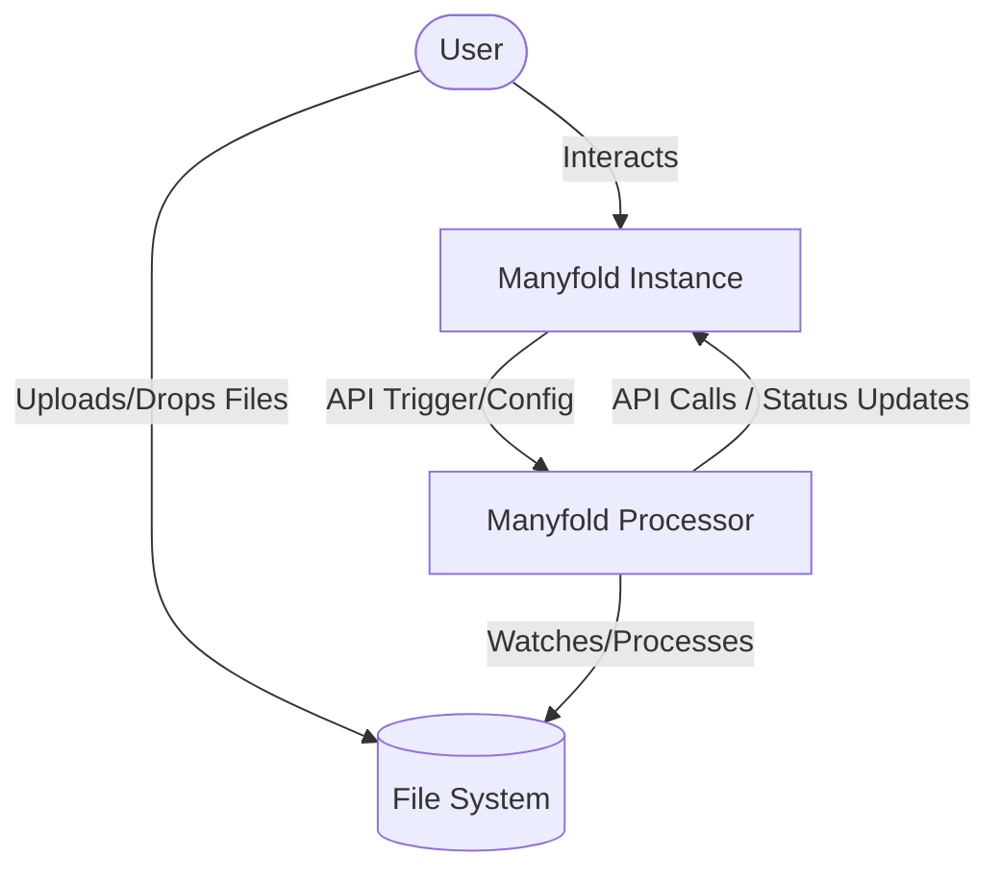
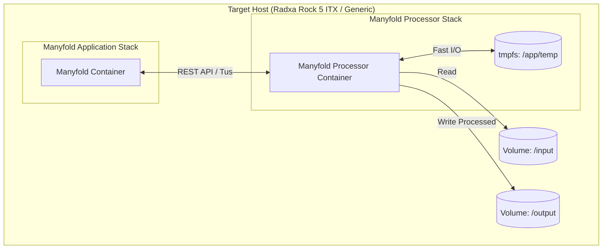
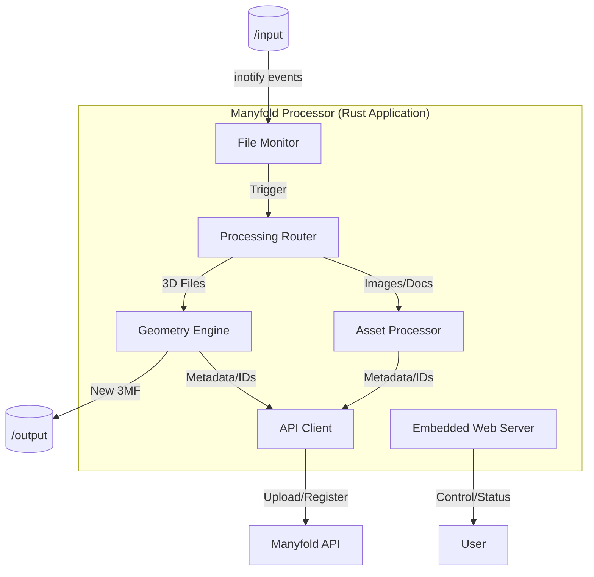

# Instructions

<!-- audited_by: .agent/workflows/audit_infrastructure.md -->
<!-- context_warning_reviewed: 449854c3e67c953899593571dc48bc9818547bc5b28afdfa42f251dfeb8c3d85 -->

When creating new features, refactoring code, or analyzing the system, use this document to understand the architectural boundaries and responsibilities.

1.  **Language**: **Rust** is the primary language for all application logic. Python may be used only for legacy wrapping or prototyping but should be phased out.
2.  **Deployment**: The application is **container-native**. It must be designed to run as a Docker container from the start.
3.  **Independence**: This is a standalone **Utility** for Manyfold, NOT part of the Manyfold core project.
4.  **Interaction**: All interaction with the Manyfold instance must occur via **API calls**. No direct database sharing or internal linking unless explicitly required by the utility nature (e.g., shared volumes for file processing).
5.  **Structure**: All design decisions follow the **C4 Model** (see [c4_model](../c4_model/SKILL.md)).

---

# System Architecture (C4 Model)
> [!NOTE]
> For a detailed explanation of the C4 levels and how they map to our skills, see the [c4_model](../c4_model/SKILL.md) skill.

## Level 1: System Context
**Goal**: Show how the software fits into the world.

The **Manyfold Processor** is an external utility that automates file processing for a Manyfold instance.

*   **Users**: Interact via the **WebUI** or drop files into the Input Directory.
*   **Manyfold Processor**: The standalone utility (Rust + Docker).
*   **Manyfold Instance**: The target application where processed files are destined.
    *   *Interaction*: API-based.
*   **File System**: Shared volumes for Input/Output.

## Level 2: Containers
**Goal**: Show the high-level technical building blocks (deployable units).

The system is delivered as a single cohesive unit, optimized for Docker on Radxa Rock 5 ITX.

1.  **Main Application Container (Rust)**:
    *   **Core Logic**: Handles file monitoring, geometry processing, and metadata generation.
    *   **Web Server**: Embedded (e.g., Actix/Axum) to serve the WebUI and API endpoints.
2.  **Manyfold Instance (External)**: The separate service we interact with via API.

## Level 3: Components (Rust Application)
**Goal**: Show the internal structure of the Rust application.

1.  **File Monitor**: Watches the `/input` directory for changes.
2.  **Processing Pipeline**:
    *   **Router**: Determines method (File vs Directory vs Archive).
    *   **Geometry Engine**: Internal Rust modules for mesh conversion and merging.
    *   **Asset Processor**: Handling images and other assets.
3.  **API Client**: Manages authentication and communication with the Manyfold API.
4.  **WebUI Backend**: Serves the frontend interface and handles user control.

## Level 4: Code
**Goal**: Highlight key implementation details.

*   **Language**: Rust (Edition 2021+).
*   **Concurrency**: Async/Await (Tokio) for I/O-bound tasks (API calls, file watching).
*   **Performance**: Zero-cost abstractions where possible. Minimal memory footprint.
*   **Error Handling**: Robust `Result` handling. No panics in production.
*   **Verification**: All features MUST be verified using a **Dual-Track** approach (UI and API).
    *   See [testing_philosophy](../testing_philosophy/SKILL.md) for details.

## Technical Goals & Constraints
*   **Primary Language**: Rust.
*   **Core Platform**: Docker on Radxa Rock 5 ITX (Linux/Arm64).
*   **Separation of Concerns**: The Processor sees Manyfold as a black box accessed via API.
## 6. Multi-Platform Strategy

While the Radxa Rock 5 ITX is the primary target, the system must run on generic hardware (AMD64, Raspberry Pi, etc.).

### The "Tiered Support" Model

1.  **Tier 1: Radxa Rock 5 (Target)**
    *   **Features**: NPU Inference, RGA Image Processing, RAM Drive heavy usage.
    *   **Condition**: Detected RK3588 SoC + `/dev/rga` present.

2.  **Tier 2: Generic High-Power (AMD64 / Modern ARM64)**
    *   **Features**: CPU Inference (ONNX Runtime), Software Image Processing (image-rs), Standard Disk I/O (if RAM limited).
    *   **Condition**: Variable hardware.
    *   **Requirement**: "Graceful Degradation". The application must **not crash** if `/dev/rga` is missing; it must switch to the CPU implementation.

3.  **Tier 3: Legacy/Low-Power (ARMv7 / Pi 2)**
    *   **Features**: Basic file monitoring, simple metadata extraction. Heavy 3D/ML tasks may be disabled or strictly serial.
    *   **Condition**: 32-bit architecture or < 2GB RAM.

### Implementation Mandate
*   **Memory Management (Tier 3 Critical)**: 
    *   See [environment_constraints](../environment_constraints/SKILL.md) for all memory reservation and limit values.
    *   **Internal Check**: The application MUST still check available RAM on startup and exit if below minimum, as a double-check against misconfiguration.
*   **Runtime Detection**: Use dynamic loading (`libloading`) or feature flags for hardware libraries (`librga`) to ensure the binary runs on systems where these libraries are absent.
*   **Abstract Traits**: Define traits like `ImageProcessor` with implementations for `RgaProcessor` and `CpuProcessor`.
