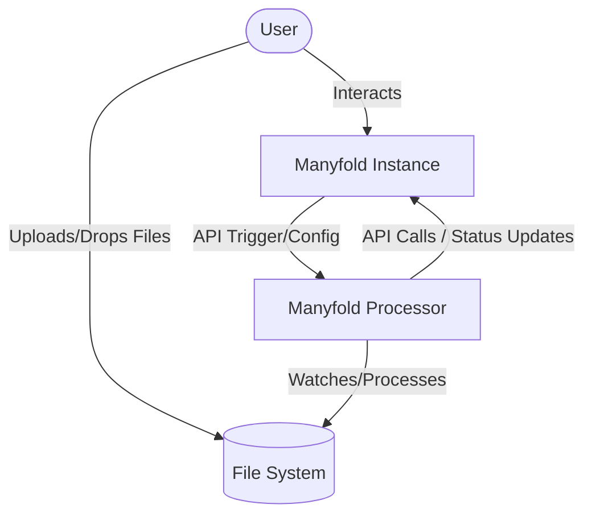
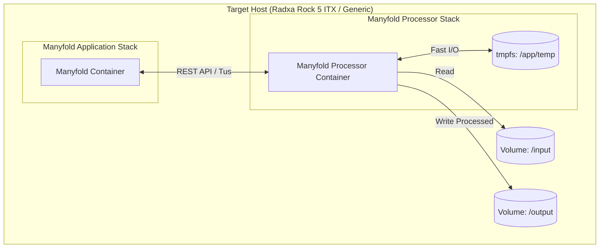
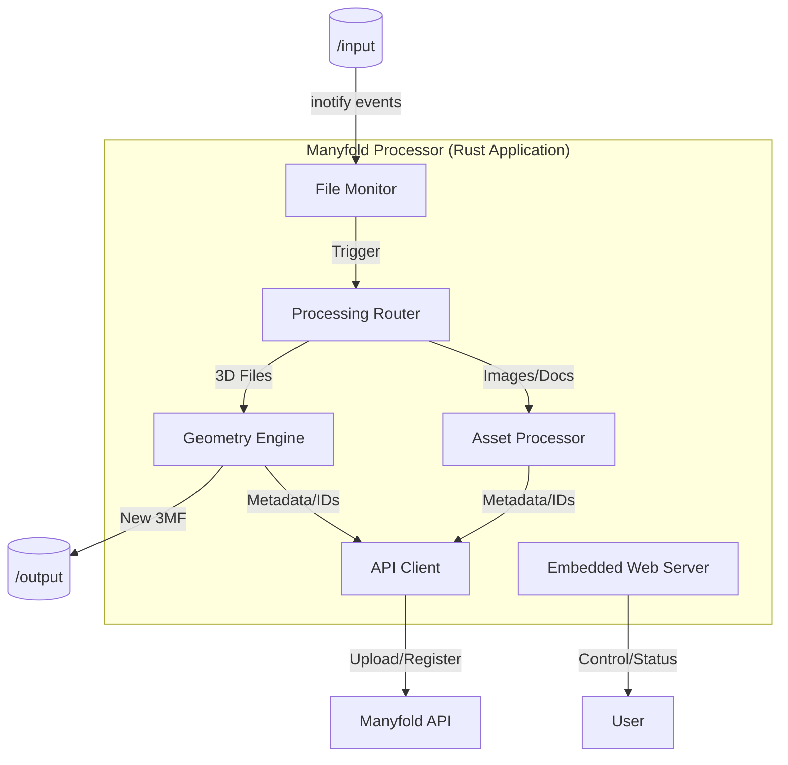

# C4 Model in Manyfold Processor

The C4 model is a lean graphical notation technique for modelling the architecture of software systems. It is the **primary architectural language** for this project.

## 1. The Four Levels

### Level 1: System Context
*   **Definition**: The highest level of abstraction. It shows the system in its environment.
*   **Mapping**: [architectural_guidelines](../architectural_guidelines/SKILL.md#level-1-system-context)
*   **Key Skill**: `manyfold_api_integration` (defines the boundary with the external Manyfold instance).

### Level 2: Containers
*   **Definition**: The high-level technical building blocks (e.g., Docker containers).
*   **Mapping**: [architectural_guidelines](../architectural_guidelines/SKILL.md#level-2-containers)
*   **Key Skill**: `deploy_on_radxa_rock5` (defines the container environment and constraints).

### Level 3: Components
*   **Definition**: The logical modules inside the container.
*   **Mapping**: [architectural_guidelines](../architectural_guidelines/SKILL.md#level-3-components)
*   **Key Skills**: 
    *   `stl_handling`: Geometry Engine component.
    *   `3mf_handling`: Geometry Engine component.
    *   `logging_and_monitoring`: Observability component.

### Level 4: Code
*   **Definition**: Implementation details and patterns.
*   **Mapping**: [architectural_guidelines](../architectural_guidelines/SKILL.md#level-4-code)
*   **Key Skill**: `cucumber_gherkin_reference` (defines the code-level testing strategy).

---

## 2. Why it is Critical (v0.3 Overhaul)

1.  **Strict Boundaries**: Enforces the "Black Box" rule between the Processor and Manyfold.
2.  **Modular Knowledge**: Connects general documentation to specific specialized skills.
3.  **Hardware Awareness**: The Container (Level 2) logic changes based on the Tier (Pi vs. Rock 5) documented in [workshop_log.md](../../notes/workshop_log.md).

## 3. Visualizing Relationships

### Level 1: System Context

### Level 2: Containers

### Level 3: Components

## 4. Usage Requirements
*   Every new feature must be justified by its position in the C4 hierarchy.
*   Changes at Level 1 or 2 require an explicit update to the `architectural_guidelines` and a consistency check via `/check_docs_consistency`.
*   Use the **`/generate_c4_diagram`** workflow to create or update visual representations.
