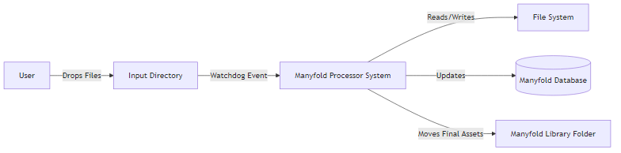
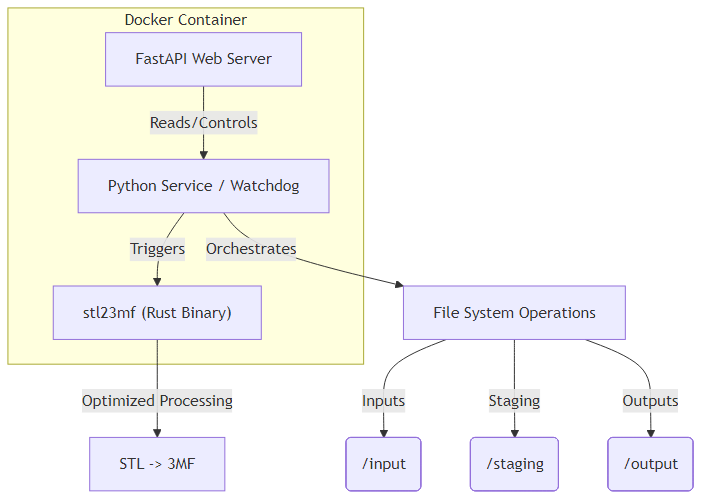
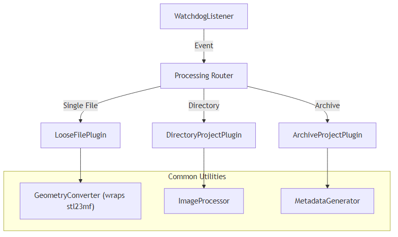

# System Architecture (C4 Model)

This document describes the Manyfold Processor system using the C4 model (Context, Containers, Components, Code), moving from high-level abstractions to low-level implementation details.

## Level 1: System Context
**Goal**: Show how the software fits into the world.

The **Manyfold Processor** acts as a bridge between the **User** (providing raw files) and the **Manyfold Service** (hosting the processed library).

*   **Users**: Drop files into the Input Directory.
*   **Manyfold Processor**: The software system being described.
*   **File System**: Source of inputs and destination for outputs.
*   **Manyfold Database**: External PostgreSQL database updated by the processor.

---

## Level 2: Containers
**Goal**: Show the high-level technical building blocks (deployable units).

The system runs efficiently on low-power hardware (Radxa Rock 5 ITX) using a Dockerized environment.

1.  **Python Service (Watchdog)**: The core entry point. Uses `watchdog` to listen for file system events. Orchestrates the flow.
2.  **FastAPI Web Server**: Provides the UI/API for manual control and staging review. Runs in the same process/container to share state.
3.  **stl23mf (Rust Binary)**: A specialized, high-performance internal tool built to handle geometry conversion (STL to 3MF) and merging, replacing the slower Python `trimesh` library.
4.  **File System**: The mapped Docker volumes (`/input`, `/output`, `/staging`).

---

## Level 3: Components
**Goal**: Show the internal modules within the Python Service.

The Python application is structured into plugin-based processors and a core event loop.

1.  **WatchdogListener**: Hooks into OS file events. Debounces rapid updates.
2.  **Processing Router**: Decides which plugin handles the incoming path (File vs Directory vs Archive).
3.  **Plugins**:
    *   **LooseFilePlugin**: Handles individual `.stl` or `.3mf` files.
    *   **ArchiveProjectPlugin**: Handles `.zip`, `.7z`, `.rar`, and complex `.3mf` archives (Case 2/4).
    *   **DirectoryProjectPlugin**: Handles folders dropped into input (Case 4).
4.  **GeometryConverter**: Wrapper class that invokes the `stl23mf` Rust binary for heavy lifting.
5.  **ImageProcessor**: Handles image conversion (to WebP) and resizing.
6.  **MetadataGenerator**: Creates the `datapackage.json` required by Manyfold.

---

## Level 4: Code
**Goal**: Highlight key implementation details (Classes/Methods).

### Core Classes
*   **`ProjectPlugin` (Abstract Base)**:
    *   `process(path: Path)`: Main entry point for any plugin.
    *   `validate(path: Path)`: Checks if the file is ready/valid.

*   **`DirectoryProjectPlugin`**:
    *   `process_recursive()`: Iterates through the folder, classifying files into Models or Images.
    *   `_merge_stls()`: Calls `geometry_converter`.

*   **`GeometryConverter`**:
    *   `merge_stls_to_3mf(inputs: List[Path], output: Path)`: Constructs the CLI command for `stl23mf` and executes it.

### Key Data Structures
*   **`ProcessingContext`**: passed down the chain, containing:
    *   `job_id`: Unique tracking ID.
    *   `working_dir`: Temp path for atomic operations.
    *   `manifest`: Dictionary of assets found.

## Technical Goals & Constraints
*   **Hardware**: Radxa Rock 5 ITX (16GB RAM).
*   **Performance**:
    *   Memory: <50MB (Python) + Minimal (Rust).
    *   Strategy: Stream ZIP reading (no full load), Rust for geometry.
*   **Strict Type**: Logic must handle `3mf`, `stl`, `obj`, `jpg`, `png`, `webp`, `txt`, `json`, and various archive formats.
