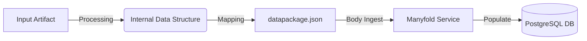

# Manyfold Data Architecture & Logic

## 🔄 Data Pipeline Overview
The content ingestion process follows a strictly defined path from raw 3D archives to the database.



### Input Scenarios
The pipeline must handle four distinct input cases:
1.  **Raw File**: Direct `.stl` files.
2.  **MakerWorld 3MF**: Rich metadata source.
3.  **Generic 3MF**: Standard metadata source.
4.  **Mixed Archive**: Compressed folders containing any mix of the above.

---

## 📦 Artifact Structure

### 1. Source: 3MF Archive
The input content is primarily distributed as `.3mf` files, which are ZIP containers.
*   **Path**: `[LibraryRoot]/[Category]/[ModelName]/[ModelFile].3mf`
*   **Internal Structure**:
    *   `3D/3dmodel.model`: Main XML definition containing mesh data and metadata.
    *   `Metadata/`: Config files and thumbnails.

### 2. Bridge: `datapackage.json`
This file acts as the semantic layer that Manyfold reads. It must be generated and placed in the model's folder.
**Key Fields**:
*   `name`: Machine-readable slug (e.g., `paladin-fighter`).
*   `title`: Human-readable title (e.g., `Paladin/Fighter`).
*   `resources`: List of files (models, images) with their properties.
    *   **Crucial**: Links `.3mf` and `.jpg` files via relative `path`.
*   `contributors`: Creator information.

### 3. Destination: Database (PostgreSQL)

#### `models` Table
The core entity representing a 3D object.
| Column | Source | Description |
| :--- | :--- | :--- |
| `name` | JSON `title` | Display name of the model. |
| `path` | File System | **Relative path** from the library root (e.g., `dnd/fantasy/...`). |
| `slug` | JSON `name` | URL-safe identifier. |
| `library_id` | DB `libraries` | Foreign key to the storage library. |
| `preview_file_id`| DB `model_files` | ID of the default image. |

#### `model_files` Table
Represents individual files associated with a model.
| Column | Source | Description |
| :--- | :--- | :--- |
| `filename` | JSON `resources` | Name of the file (e.g., `model.3mf`). |
| `model_id` | DB `models` | FK to the parent model. |

#### `libraries` Table
Defines the physical storage roots.
| ID | Path | Type | Note |
| :--- | :--- | :--- | :--- |
| `1` | `/libraries` | `filesystem` | Main library root. |
| `2` | `/test2` | `filesystem` | Test library root. |

---

## ⚠️ Key Logic & Constraints
1.  **Metadata Extraction**: The processor must parse `3D/3dmodel.model` within the 3MF zip to extract the `Description` and `Title` (if available) to populate `datapackage.json`.
2.  **Naming Convention**: `datapackage.json` `name` field should match the folder name slug to ensure consistency.
3.  **Path Resolution**: The database stores paths *relative* to the Library Root. A file at `/srv/mergerfs/Black_Library/Manyfold/dnd/model` belonging to Library ID 1 (`/libraries` -> mapped to `/srv/mergerfs/Black_Library/Manyfold`) would be stored as `dnd/model`.
## 🖼️ Image Handling Logic
*   **Target Format**: All images must be converted to **WebP** for optimal performance in Manyfold.
## 🖼️ Image Handling Logic
*   **Target Format**: All images must be converted to **WebP**.

### Case 1 (STL) Priority
1.  **Sibling Image**: If a valid image (`.jpg`, `.png`) exists next to the STL (matching name or only image), use it.
2.  **Rendered Preview**: If no image exists, generate a render.

### Case 2/3 (3MF) Priority
1.  **Extraction**: Extract `ThumbNail.png` (or similar) from the ZIP.
2.  **Rendered Preview**: Fallback if no internal thumbnail matches.


## 📂 Output Directory Structure
*   **Rule**: Every processed model **MUST** be placed in its own dedicated subdirectory.
*   **Naming**: The directory name must match the slug/basename of the primary `.3mf` file.
*   **Example**:
    ```text
    /libraries/dnd/
    └── sophia-35mm-sophia/           <-- Dedicated Folder (matches 3MF name)
        ├── sophia-35mm-sophia.3mf    <-- The Model
        ├── datapackage.json          <-- The Definition
        └── preview.webp              <-- The Image
    ```


